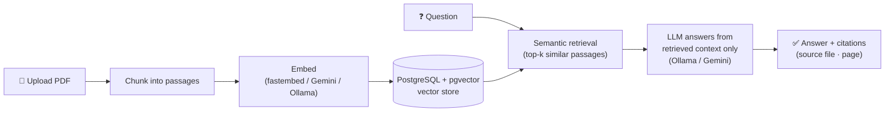

# 📄 PaperMind — RAG Document Q&A, Local or Cloud

**Upload a PDF, ask questions, get answers grounded in the document — with citations.** A production-shaped Retrieval-Augmented Generation (RAG) service that runs fully offline on your laptop *or* scales to the cloud, by flipping two environment variables.


PaperMind answers questions about your documents instead of from an LLM's memory: it retrieves the most relevant passages from *your* PDFs and asks the model to answer **only** from those — then returns the source file and page for every answer, so you can trust and verify it.

---

## 💡 Why it's built this way

Most RAG demos hard-wire one cloud provider and one database. PaperMind is **provider-agnostic and 12-factor**: the embedding model, the chat model, and the database are all chosen at runtime from environment variables, with local-friendly defaults. The same code runs:

- **Fully local & free** — fastembed embeddings + Ollama (`llama3.2`) + Docker Postgres. No API keys, no rate limits, nothing leaves your machine.
- **In the cloud** — Gemini for embeddings/chat + a hosted Postgres (e.g. Neon) — by setting three env vars, no code changes.

Secrets live only in a git-ignored `.env`; a committed `.env.example` documents every setting.

---

## 🏗️ How it works



**Ingestion:** PDFs are split into overlapping passages, embedded, and stored as vectors in pgvector.
**Query:** your question is embedded, the most similar passages are retrieved, and the LLM is prompted to answer **grounded in those passages** — returning the file and page it used.

---

## 🔌 API

| Method | Endpoint | Purpose |
|--------|----------|---------|
| `GET`  | `/`       | Web UI — upload PDFs and ask questions in the browser |
| `GET`  | `/health` | Health check |
| `GET`  | `/papers` | List the PDFs currently in the library |
| `POST` | `/upload` | Upload a PDF; it's chunked, embedded, and indexed on the fly |
| `POST` | `/ask`    | Ask a question → `{ answer, sources: [{source, page}] }` |

---

## 🚀 Quickstart

```bash
# 1. Start the vector database (Postgres + pgvector)
docker compose up -d

# 2. Install
python3 -m venv .venv && source .venv/bin/activate
pip install -r requirements.txt

# 3. (Optional) configure providers — defaults are fully local
cp .env.example .env        # edit if you want Gemini / a cloud DB

# 4. Run
uvicorn app.main:app --reload
```

Open **http://localhost:8000** — upload a PDF and start asking. Runs 100% locally out of the box (fastembed + Ollama); no keys required.

### Go cloud (no code changes)
```bash
MODEL_PROVIDER=gemini
EMBED_PROVIDER=gemini
DATABASE_URL=postgresql://…   # e.g. a Neon serverless Postgres
```

---

## ⚙️ Configuration (environment variables)

| Variable | Default | Options |
|----------|---------|---------|
| `EMBED_PROVIDER` | `fastembed` | `fastembed` · `gemini` · `ollama` |
| `MODEL_PROVIDER` | `ollama` | `ollama` · `gemini` |
| `DATABASE_URL`   | local Docker Postgres | any Postgres/pgvector URL |
| `COLLECTION`     | `papermind_papers` | vector collection name |

---

## 🗂️ Project structure

```
app/
├── main.py         # FastAPI app + endpoints (/ /health /papers /ask /upload)
├── ingest.py       # PDF loading + chunking
├── embed_store.py  # embeddings + pgvector storage (with input sanitization)
├── rag.py          # retrieve relevant passages → generate a grounded answer
└── config.py       # 12-factor provider/DB selection from env vars
frontend/           # PDF-upload + Q&A web page
docker-compose.yml  # Postgres + pgvector
```

## 🧰 Tech stack
Python · FastAPI · LangChain · PostgreSQL + pgvector · fastembed · Ollama · Google Gemini · Docker

## 🗺️ Roadmap
- [x] End-to-end RAG (ingest → embed → retrieve → generate) with citations
- [x] Provider-agnostic, cloud-ready config (local ↔ cloud with env vars)
- [x] Web UI for upload + Q&A
- [ ] Evaluation harness (retrieval hit-rate, answer faithfulness)
- [ ] Streaming responses + multi-document filtering
- [ ] One-click cloud deploy

## 📬 Contact

**Nemili Enoch Das** — MS Computer Science @ George Washington University.
Open to full-time / early-career software engineering roles (AI infrastructure, backend, ML systems).

- 📧 [enoch.das@gmail.com](mailto:enoch.das@gmail.com)
- 💻 GitHub: [@Enoch-Nemili](https://github.com/Enoch-Nemili)
- 💼 LinkedIn: _add your profile URL here_

## 📄 License
MIT — see [LICENSE](LICENSE).
