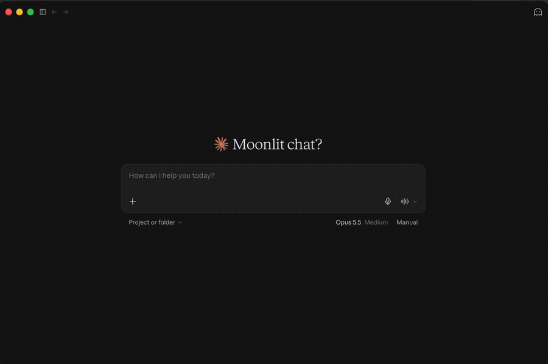
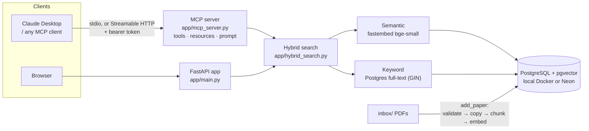

# PaperMind — Research-Paper RAG, as an MCP Server and a Web App

**Give any AI assistant a searchable, citable library of research papers.** PaperMind indexes PDFs into PostgreSQL + pgvector and exposes them through the **Model Context Protocol (MCP)**, so Claude Desktop (or any MCP client) can search your papers and answer with *(paper, page)* citations. The same retrieval also powers a FastAPI web app.

[](https://github.com/Enoch-Nemili/papermind/actions/workflows/ci.yml)




## Highlights

- **MCP server with all three primitives.** 3 tools, 2 resources and 1 prompt. Typed Pydantic outputs, so every tool publishes an output schema. Tool annotations mark which tools are read-only.
- **Hybrid retrieval, tuned by measurement.** Semantic search (pgvector) plus Postgres full-text search, fused with Reciprocal Rank Fusion. The fusion weight was chosen on a 36-question labeled eval with a decision rule fixed before the run: **78% hit@1, 97% recall@5, 0.841 MRR** (see [Evals](#evals)).
- **Security enforced in code, not in the prompt.** `add_paper` can only read from `inbox/`; path traversal, symlink escapes and fake PDFs are refused. HTTP mode requires a bearer token and refuses to start on a network address without one.
- **Tested.** 59 unit, protocol and HTTP tests plus live retrieval evals. CI runs lint and tests on Python 3.12 and 3.14, builds the Docker image, and checks that the container rejects unauthenticated requests.
- **Runs two ways.** Over stdio for desktop clients, or over Streamable HTTP in a multi-stage, non-root Docker image (836 MB, down from 978 MB) with the embedding model built in.

## Architecture



The MCP client's own model does the reasoning. PaperMind's job is **retrieval you can trust**: find the right passages and return them with their source paper, page and relevance score.

## MCP server

| Kind | Name | What it does |
|------|------|--------------|
| Tool | `search_papers(query, k=1..10)` | Hybrid search; returns passages with `source`, `page`, `relevance`, `text`. Read-only |
| Tool | `list_papers()` | Lists the PDFs in the library. Read-only |
| Tool | `add_paper(filename)` | Indexes a PDF from `inbox/`. Idempotent and non-destructive |
| Resource | `papermind://library` | JSON catalog: title, page count, size for each paper |
| Resource | `papermind://papers/{filename}` | Metadata for one paper |
| Prompt | `answer_from_papers(question)` | Makes the model search 1–3 times, cite *(paper, p. N)*, and say when the library doesn't cover the question instead of guessing |

### Use it in Claude Desktop

Add this to `~/Library/Application Support/Claude/claude_desktop_config.json` and restart Claude:

```json
{
  "mcpServers": {
    "papermind": {
      "command": "/ABSOLUTE/PATH/TO/papermind/.venv/bin/python",
      "args": ["/ABSOLUTE/PATH/TO/papermind/app/mcp_server.py"]
    }
  }
}
```

Logs go to stderr, because stdout carries the protocol. On macOS they appear in `~/Library/Logs/Claude/mcp-server-papermind.log`.

### Inspect it

```bash
npx @modelcontextprotocol/inspector .venv/bin/python app/mcp_server.py
```

### Serve it over HTTP (Docker)

```bash
echo "PAPERMIND_TOKEN=$(python -c 'import secrets; print(secrets.token_urlsafe(32))')" >> .env
docker build -t papermind-mcp .
docker run --rm --env-file .env -p 127.0.0.1:8765:8765 \
  -v "$PWD/data:/app/data" -v "$PWD/inbox:/app/inbox" papermind-mcp

python scripts/smoke_http.py      # sends the token from .env
```

Clients authenticate with `Authorization: Bearer <PAPERMIND_TOKEN>`. Without Docker, `python app/mcp_server.py --http` serves on `127.0.0.1:8765`; it won't bind to a network address unless a token is set.

## Search: how it works and how it was tuned

`search_papers` runs two searches over the same chunks and merges them:

1. **Semantic**: the query is embedded (bge-small-en-v1.5) and matched against pgvector by cosine similarity. Finds passages with the same *meaning*.
2. **Keyword**: Postgres full-text search over a generated `tsvector` column with a GIN index. Finds passages with the same *words*. Queries are reduced to alphanumeric OR-terms, so user input can't inject query operators.
3. **Reciprocal Rank Fusion**: each list votes `weight / (60 + rank)` per chunk; chunks ranked well by both win. Ranks are fused rather than raw scores, which aren't on comparable scales. If full-text search is unavailable, search falls back to semantic-only instead of failing.

### Evals

`scripts/eval_retrieval.py` runs labeled questions ([`evals/`](evals/)) through every method and reports hit@1 (was the #1 result from the right paper?), recall@5 and MRR. Full output: [`evals/results.md`](evals/results.md).

| Method (36 questions) | hit@1 | recall@5 | MRR |
|---|---|---|---|
| Semantic only | 78% | 94% | 0.838 |
| Keyword only | 67% | 81% | 0.728 |
| Hybrid, equal weights | 75% | 94% | 0.826 |
| **Hybrid, keyword weight 0.5 (default)** | **78%** | **97%** | **0.841** |

What the numbers showed:

- **Equal-weight fusion was slightly worse than semantic alone**, so keyword search is a light tiebreaker (weight 0.5), not an equal partner. The weight was picked by a rule fixed before the run (best MRR; within 0.02, higher recall@5 wins), not by trying values until a test passed.
- **The embedding model handles exact terms well on its own**: 10/10 on queries like "PagedAttention" or "RAG-Sequence versus RAG-Token".
- **Most remaining misses are long-document bias**: T5 (67 pages, covers nearly every topic) wins many plain-English questions under any weight. Tracked in [#9](https://github.com/Enoch-Nemili/papermind/issues/9).

`python scripts/explain_search.py "<query>"` shows both rankings and the fused result for any query.

## Security

| Risk | Mitigation |
|------|------------|
| Path traversal (`../.env`, `sub/../../x.pdf`) | The path is resolved, and its parent must be exactly `inbox/`. Covered by tests |
| Symlink escape | Resolving follows symlinks, so a link pointing outside `inbox/` is refused. Covered by a test |
| Non-PDF or disguised files | Needs a `.pdf` extension, a size limit and the `%PDF-` file signature |
| Partial writes | If indexing fails, the copied file is removed |
| Excessive agency (OWASP LLM Top 10) | The model can only *read* the library and add files the user already put in `inbox/`. It has no delete and no arbitrary file access |
| Unauthenticated network access | HTTP mode verifies a bearer token (constant-time compare, 32+ chars) through the SDK's resource-server auth; it refuses to bind a network address without one. CI checks the container returns 401 |
| Query injection | Keyword queries are reduced to alphanumeric terms before reaching `to_tsquery`; all SQL is parameterized |
| Container | Runs as a non-root user. Secrets come from `--env-file` at runtime and are never built into the image |

**Scope:** MCP authorization makes the server an OAuth resource server. A shared secret suits a self-hosted tool; full OAuth means swapping in a `TokenVerifier` that validates JWTs from an authorization server (Auth0, Keycloak). Nothing else changes.

## Bugs found by testing

- **Path traversal in the web `/upload` endpoint**: a crafted filename could write outside `data/`. Found while writing the security tests; fixed with a regression test.
- **Dead connections after Neon auto-suspends**: a server idle for hours failed its next search with `AdminShutdown: terminating connection due to administrator command`, because the pool reused a connection the database had killed. Found in a long-running container's logs, reproduced by restarting Postgres between two queries, and fixed with `pool_pre_ping` + `pool_recycle` ([#13](https://github.com/Enoch-Nemili/papermind/issues/13)).

## Tests

```bash
pip install -r requirements-dev.txt
ruff check app tests scripts
pytest -v                      # 59 fast tests, no database needed
pytest -m integration -v       # retrieval checks against the real vector store
python scripts/eval_retrieval.py
```

The fast suite connects a real in-process MCP client to the server, and sends real HTTP requests through the SDK's auth middleware. The database and embedder are replaced with fakes, so it checks the protocol surface, input validation, fusion logic and security boundaries without needing any infrastructure.

## Web app

```bash
docker compose up -d                       # local Postgres + pgvector
python3 -m venv .venv && source .venv/bin/activate
pip install -r requirements.txt
cp .env.example .env                       # defaults are fully local
python -m app.embed_store                  # index the PDFs in data/
uvicorn app.main:app --reload              # http://localhost:8000
```

| Method | Endpoint | Purpose |
|--------|----------|---------|
| `GET`  | `/`       | Web UI: upload PDFs and ask questions |
| `GET`  | `/health` | Health check |
| `GET`  | `/papers` | List the library |
| `POST` | `/upload` | Upload a PDF; it's validated, chunked, embedded and indexed |
| `POST` | `/ask`    | Ask a question; returns `{ answer, sources: [{source, page}] }` |

## Configuration

| Variable | Default | Purpose |
|----------|---------|---------|
| `DATABASE_URL`    | local Docker Postgres | any Postgres + pgvector URL (e.g. Neon) |
| `EMBED_PROVIDER`  | `fastembed` | `fastembed` · `gemini` · `ollama` |
| `MODEL_PROVIDER`  | `ollama` | `ollama` · `gemini` (only used by the web app's `/ask`) |
| `PAPERMIND_TOKEN` | unset | bearer token for HTTP mode; required beyond localhost |

Secrets live only in a git-ignored `.env`. The committed `.env.example` documents every setting.

## Project structure

```
app/
├── mcp_server.py      # MCP server: tools, resources, prompt; stdio + HTTP
├── hybrid_search.py   # semantic + keyword search fused with RRF
├── keyword_search.py  # Postgres full-text search (tsvector + GIN)
├── auth.py            # bearer-token verifier for HTTP mode
├── retrieval_metrics.py
├── embed_store.py     # pgvector storage, ingestion, connection pooling
├── pdf_loader.py      # PDF -> per-page documents with citation metadata
├── embeddings.py      # fastembed adapter
├── ingest.py          # chunking
├── main.py, rag.py    # FastAPI web app
└── config.py          # provider/DB selection from env vars
evals/                 # labeled questions + latest results
scripts/               # eval, search explainer, HTTP smoke test
tests/                 # protocol, security, auth, fusion, metrics, API tests
Dockerfile             # multi-stage, non-root MCP server image
.github/workflows/     # CI: lint + tests (3.12, 3.14) + Docker build and auth checks
```

## Roadmap

- [x] End-to-end RAG with citations, plus a web UI
- [x] MCP server: tools, resources, prompt, typed outputs, annotations
- [x] Security boundary, tests and CI
- [x] Streamable HTTP transport + multi-stage Docker image
- [x] Hybrid retrieval with a labeled eval set and measured tuning
- [x] Bearer-token auth for HTTP mode
- [x] Off deprecated `langchain-community` (verified identical text and vectors)
- [ ] Long-document bias: per-paper diversity or length normalization ([#9](https://github.com/Enoch-Nemili/papermind/issues/9))
- [ ] Full OAuth via a JWT `TokenVerifier`

## Contact

**Nemili Enoch Das**, MS Computer Science @ George Washington University. Open to full-time and early-career software engineering roles in AI infrastructure, backend and ML systems.

- Email: [enoch.das@gmail.com](mailto:enoch.das@gmail.com)
- GitHub: [@Enoch-Nemili](https://github.com/Enoch-Nemili)
- LinkedIn: [enoch-nemili](https://www.linkedin.com/in/enoch-nemili/)

## License

MIT. See [LICENSE](LICENSE).
