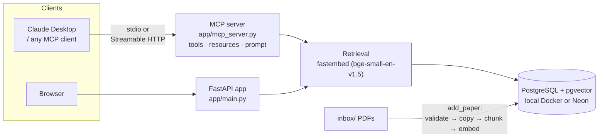

# PaperMind — Research-Paper RAG, as an MCP Server and a Web App

**Give any AI assistant a searchable, citable library of research papers.** PaperMind indexes PDFs into PostgreSQL + pgvector and exposes them through the **Model Context Protocol (MCP)**, so Claude Desktop (or any MCP client) can search your papers and answer with *(paper, page)* citations. The same retrieval also powers a FastAPI web app.

[](https://github.com/Enoch-Nemili/papermind/actions/workflows/ci.yml)


<!-- Demo GIF goes here:  -->

## Highlights

- **MCP server with all three primitives.** 3 tools, 2 resources and 1 prompt. Typed Pydantic outputs, so every tool publishes an output schema. Tool annotations mark which tools are read-only.
- **Grounded answers with citations.** In Claude Desktop, asking *"How does vLLM manage KV-cache memory?"* leads Claude to call `search_papers` and answer with page citations from the vLLM paper.
- **Security enforced in code, not in the prompt.** `add_paper` can only read from `inbox/`. Path traversal and symlink escapes are blocked, files must pass a PDF signature check, and failed indexing is rolled back.
- **Tested and measured.**
  - 29 unit, protocol and API tests run in CI on Python 3.12 and 3.14.
  - A retrieval eval against the live vector store passes 6/6, and documents one known weakness (see [Evals](#evals)).
- **Runs two ways.**
  - Over stdio for desktop clients.
  - Over Streamable HTTP inside a non-root Docker image, with the embedding model built into the image.

## Architecture



The MCP client's own model does the reasoning. PaperMind's job is **retrieval you can trust**: find the right passages and return them with their source paper, page and relevance score.

## MCP server

| Kind | Name | What it does |
|------|------|--------------|
| Tool | `search_papers(query, k=1..10)` | Semantic search; returns passages with `source`, `page`, `relevance`, `text`. Read-only |
| Tool | `list_papers()` | Lists the PDFs in the library. Read-only |
| Tool | `add_paper(filename)` | Indexes a PDF from `inbox/`. Idempotent and non-destructive |
| Resource | `papermind://library` | JSON catalog: title, page count, size for each paper |
| Resource | `papermind://papers/{filename}` | Metadata for one paper |
| Prompt | `answer_from_papers(question)` | Makes the model search 1–3 times, cite *(paper, p. N)*, and say when the library doesn't cover the question instead of guessing |

### Use it in Claude Desktop

Add this to `~/Library/Application Support/Claude/claude_desktop_config.json` and restart Claude:

```json
{
  "mcpServers": {
    "papermind": {
      "command": "/ABSOLUTE/PATH/TO/papermind/.venv/bin/python",
      "args": ["/ABSOLUTE/PATH/TO/papermind/app/mcp_server.py"]
    }
  }
}
```

Logs go to stderr, because stdout carries the protocol. On macOS they appear in `~/Library/Logs/Claude/mcp-server-papermind.log`.

### Inspect it

```bash
npx @modelcontextprotocol/inspector .venv/bin/python app/mcp_server.py
```

### Serve it over HTTP (Docker)

```bash
docker build -t papermind-mcp .
docker run --rm --env-file .env -p 127.0.0.1:8765:8765 \
  -v "$PWD/data:/app/data" -v "$PWD/inbox:/app/inbox" papermind-mcp

python scripts/smoke_http.py      # connects to http://127.0.0.1:8765/mcp
```

Without Docker: `python app/mcp_server.py --http` (defaults to `127.0.0.1:8765`).

## Security

| Risk | Mitigation |
|------|------------|
| Path traversal (`../.env`, `sub/../../x.pdf`) | The path is resolved, and its parent must be exactly `inbox/`. Covered by tests |
| Symlink escape | Resolving follows symlinks, so a link pointing outside `inbox/` is refused. Covered by a test |
| Non-PDF or disguised files | Needs a `.pdf` extension, a size limit and the `%PDF-` file signature |
| Partial writes | If indexing fails, the copied file is removed |
| Excessive agency (OWASP LLM Top 10) | The model can only *read* the library and add files the user already put in `inbox/`. It has no delete and no arbitrary file access |
| Container | Runs as a non-root user. Secrets come from `--env-file` at runtime and are never built into the image |
| Network | HTTP binds to `127.0.0.1` by default. **There is no auth, so don't expose it publicly** without adding OAuth in front |

Writing these tests also found a real path-traversal bug in the original web `/upload` endpoint. It's fixed, and a regression test now covers it.

## Tests

```bash
pip install -r requirements-dev.txt
ruff check app tests
pytest -v                      # 29 fast tests, no database needed
pytest -m integration -v       # retrieval evals against the real vector store
```

The fast suite connects a real in-process MCP client to the server. The database and embedder are replaced with fakes, so it checks the protocol surface, the input validation and the security boundaries without needing any infrastructure.

### Evals

`tests/test_retrieval_quality.py` runs queries against the indexed library and checks that the expected paper ranks first.

| Query style | Result |
|-------------|--------|
| Technical phrasing (vLLM paging, attention, LoRA, BERT, chain-of-thought, original RAG) | **6/6** expected paper ranked #1 |
| Plain English ("How does self-attention work?") | Known miss, tracked as `xfail` |

Technical phrasing scores around 0.87 relevance; plain English scores 0.65–0.69. This is a vocabulary-mismatch problem. For now, the tool description tells the model to search using the papers' own terminology. The planned fix is hybrid BM25 + vector search, after which this case should pass.

## Web app

```bash
docker compose up -d                       # local Postgres + pgvector
python3 -m venv .venv && source .venv/bin/activate
pip install -r requirements.txt
cp .env.example .env                       # defaults are fully local
python -m app.embed_store                  # index the PDFs in data/
uvicorn app.main:app --reload              # http://localhost:8000
```

| Method | Endpoint | Purpose |
|--------|----------|---------|
| `GET`  | `/`       | Web UI: upload PDFs and ask questions |
| `GET`  | `/health` | Health check |
| `GET`  | `/papers` | List the library |
| `POST` | `/upload` | Upload a PDF; it's validated, chunked, embedded and indexed |
| `POST` | `/ask`    | Ask a question; returns `{ answer, sources: [{source, page}] }` |

## Configuration

| Variable | Default | Options |
|----------|---------|---------|
| `EMBED_PROVIDER` | `fastembed` | `fastembed` · `gemini` · `ollama` |
| `MODEL_PROVIDER` | `ollama` | `ollama` · `gemini` (only used by the web app's `/ask`) |
| `DATABASE_URL`   | local Docker Postgres | any Postgres + pgvector URL (e.g. Neon) |

Secrets live only in a git-ignored `.env`. The committed `.env.example` documents every setting.

## Project structure

```
app/
├── mcp_server.py   # MCP server: tools, resources, prompt; stdio + HTTP
├── main.py         # FastAPI web app
├── embed_store.py  # embeddings + pgvector storage, PDF ingestion
├── ingest.py       # PDF loading + chunking
├── rag.py          # retrieve → grounded answer (web app)
└── config.py       # provider/DB selection from env vars
tests/              # MCP protocol, security, API and retrieval-eval tests
scripts/            # HTTP smoke test
Dockerfile          # non-root MCP server image
.github/workflows/  # CI: ruff + pytest on Python 3.12 and 3.14
```

## Roadmap

- [x] End-to-end RAG with citations, plus a web UI
- [x] MCP server: tools, resources, prompt, typed outputs, annotations
- [x] Security boundary + 29-test suite + retrieval evals in CI
- [x] Streamable HTTP transport + Docker image
- [ ] Hybrid BM25 + vector retrieval (fixes the plain-English eval)
- [ ] OAuth for remote HTTP deployments
- [ ] Migrate off deprecated `langchain-community` loaders

## Contact

**Nemili Enoch Das**, MS Computer Science @ George Washington University. Open to full-time and early-career software engineering roles in AI infrastructure, backend and ML systems.

- Email: [enoch.das@gmail.com](mailto:enoch.das@gmail.com)
- GitHub: [@Enoch-Nemili](https://github.com/Enoch-Nemili)
- LinkedIn: [enoch-nemili](https://www.linkedin.com/in/enoch-nemili/)

## License

MIT. See [LICENSE](LICENSE).
